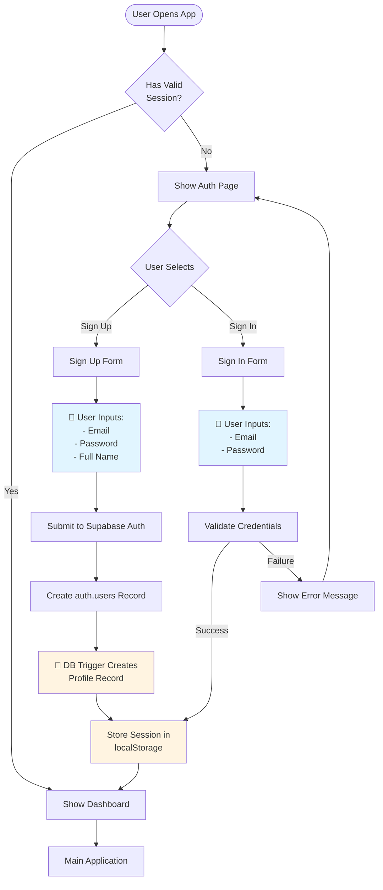
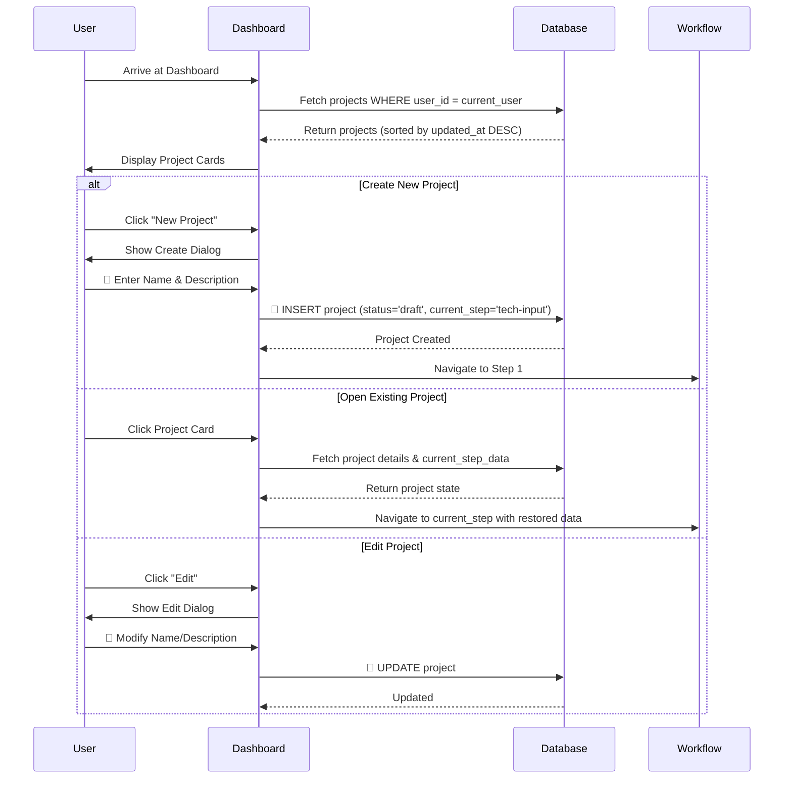
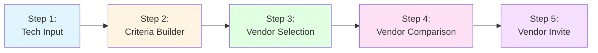
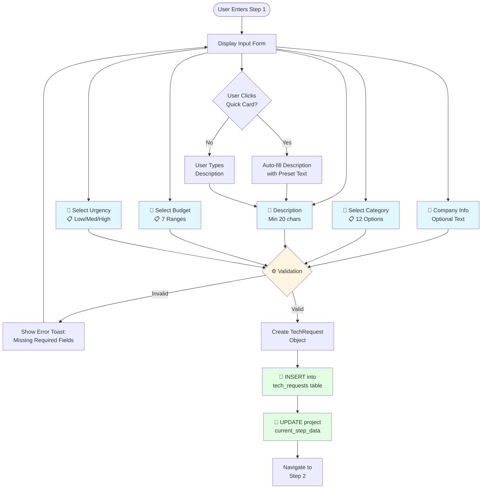
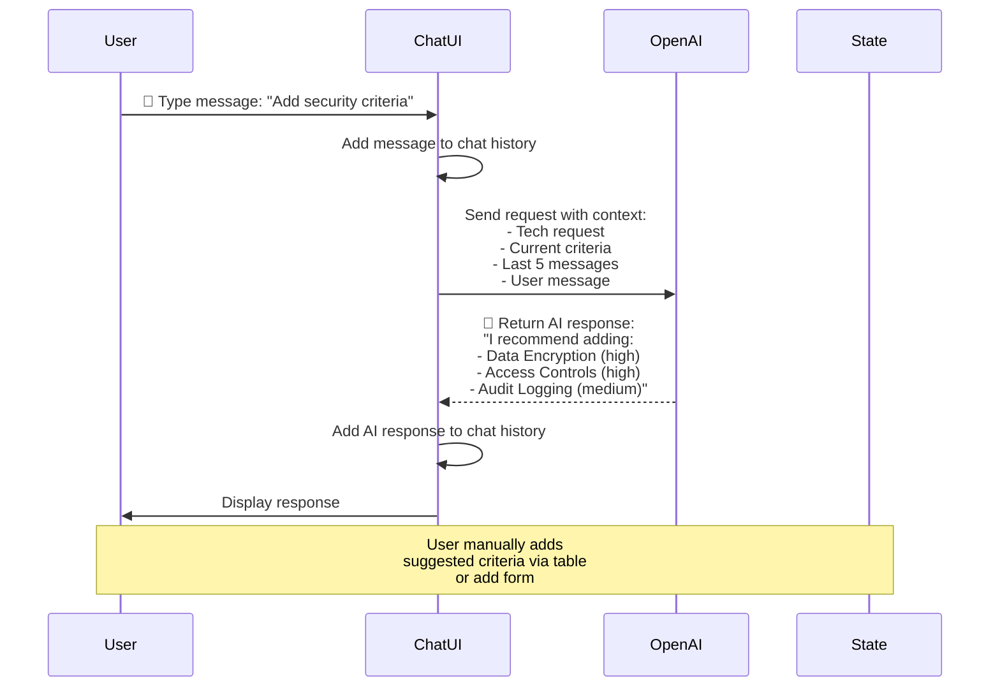
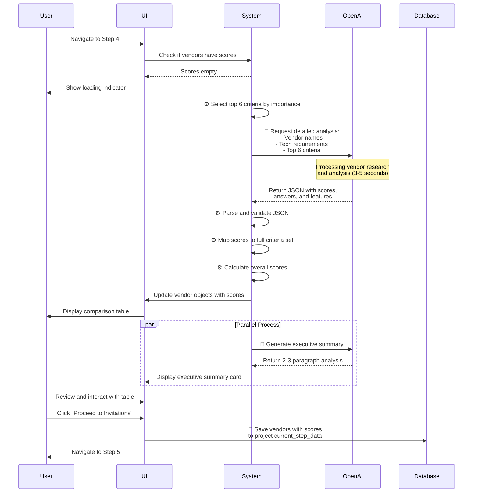
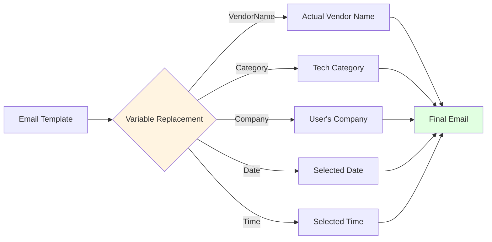
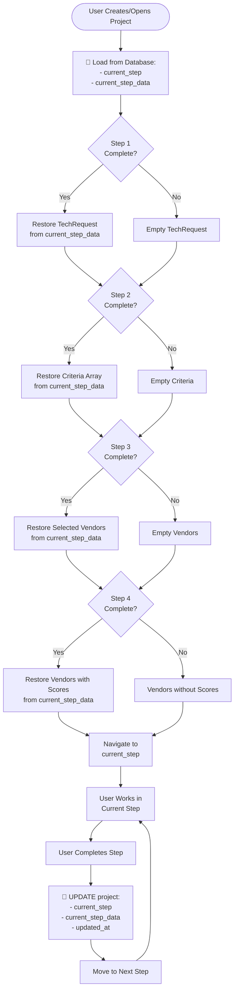
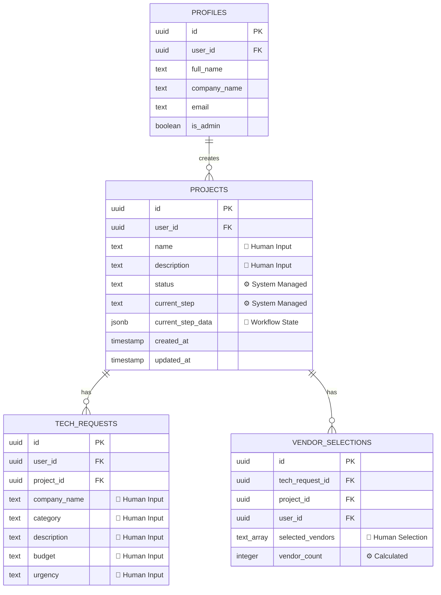

# Application Workflow Documentation

**Vendora AI Vendor Analyst - Complete User Journey**

This document provides a comprehensive step-by-step description of the application workflow, clearly distinguishing between human inputs (user-provided data) and predefined inputs (system-generated or pre-configured data).

**Last Updated:** 2025-10-26
**Document Type:** Workflow & Logic Description

---

## Table of Contents

1. [Overview](#overview)
2. [Authentication Flow](#authentication-flow)
3. [Project Management Flow](#project-management-flow)
4. [Five-Step Vendor Discovery Workflow](#five-step-vendor-discovery-workflow)
   - [Step 1: Technology Input](#step-1-technology-input)
   - [Step 2: Criteria Builder](#step-2-criteria-builder)
   - [Step 3: Vendor Selection](#step-3-vendor-selection)
   - [Step 4: Vendor Comparison](#step-4-vendor-comparison)
   - [Step 5: Vendor Invite](#step-5-vendor-invite)
5. [Data Persistence & State Management](#data-persistence--state-management)
6. [Error Handling & Fallbacks](#error-handling--fallbacks)

---

## Overview

### Application Purpose
Vendora AI Vendor Analyst is a five-step guided workflow that helps businesses discover, evaluate, and select technology vendors using AI-powered analysis.

### Core Workflow Pattern
```
Authentication → Project Selection → 5-Step Discovery → Vendor Invitations
```

### Input Types Legend
- 🙋 **Human Input** - Data provided by the user
- 🤖 **AI-Generated** - Data created by OpenAI API
- ⚙️ **System-Calculated** - Data computed by application logic
- 📋 **Predefined Options** - Fixed dropdown/selection options
- 💾 **Database-Stored** - Data persisted to Supabase

---

## Authentication Flow

### Plain English Description

**Step 1: User Arrives**
The user lands on the application. The system checks if they have a valid authentication session stored in their browser's localStorage.

**Step 2: Authentication Check**
- **If authenticated:** User is redirected to the main dashboard
- **If not authenticated:** User sees the authentication page with sign-in/sign-up options

**Step 3: Sign Up (New Users)**
The user provides their information to create an account:
- 🙋 **Email address** (user types this)
- 🙋 **Password** (minimum 6 characters, user creates this)
- 🙋 **Full name** (user types this)

When the user submits, the system:
1. Sends credentials to Supabase Auth API
2. Creates user account in `auth.users` table
3. 💾 **Database trigger automatically creates** a profile record in `profiles` table with user's email and full name
4. Stores authentication session in browser localStorage
5. Redirects user to dashboard

**Step 4: Sign In (Returning Users)**
The user provides:
- 🙋 **Email address**
- 🙋 **Password**

The system validates credentials and creates a session.

### Mermaid Diagram: Authentication Flow



---

## Project Management Flow

### Plain English Description

**Step 1: Dashboard Display**
When the authenticated user reaches the dashboard, the system:
1. Fetches all projects where `user_id` matches the current user
2. ⚙️ **Sorts projects** by `updated_at` descending (most recent first)
3. Displays projects in a card grid layout
4. Shows each project's status badge (draft/in-progress/completed/archived)

**Step 2: Create New Project**
The user clicks "New Project" button and provides:
- 🙋 **Project Name** (required, text input)
- 🙋 **Project Description** (optional, textarea)

When submitted:
1. System generates unique UUID for project
2. 💾 **Saves to database** with default values:
   - `status`: 'draft'
   - `current_step`: 'tech-input'
   - `current_step_data`: {} (empty JSONB)
   - `created_at`: current timestamp
   - `updated_at`: current timestamp
3. Redirects user to vendor discovery workflow

**Step 3: Open Existing Project**
The user clicks on an existing project card. The system:
1. Loads project details from database
2. Reads `current_step` to determine which workflow step to show
3. 💾 **Restores state** from `current_step_data` JSONB field
4. Takes user directly to their last position in the workflow

**Step 4: Edit Project Details**
The user clicks "Edit" on a project. They can modify:
- 🙋 **Project Name**
- 🙋 **Project Description**

Changes are saved to the database immediately.

### Mermaid Diagram: Project Management



---

## Five-Step Vendor Discovery Workflow

### Workflow Overview



---

## Step 1: Technology Input

### Plain English Description

**Purpose:** Collect the user's technology requirements and constraints.

**What Happens:**

1. User arrives at Step 1 and sees a form with multiple fields

2. User provides the following **human inputs** 🙋:
   - **Company Information** (optional) - Free text about their company
   - **Technology Category** - Selects from dropdown
   - **Detailed Description** (required, minimum 20 characters) - Describes what they need
   - **Budget Range** - Selects from dropdown
   - **Urgency Level** - Selects from dropdown (Low/Medium/High)

3. **Predefined dropdown options** 📋:
   - **Technology Categories**:
     - CRM Software
     - Project Management
     - Marketing Automation
     - Analytics & BI
     - Cybersecurity
     - Cloud Infrastructure
     - Collaboration Tools
     - E-commerce Platform
     - HR Management
     - Accounting Software
     - Customer Support
     - Development Tools

   - **Budget Ranges**:
     - Under $1,000/month
     - $1,000 - $5,000/month
     - $5,000 - $10,000/month
     - $10,000 - $25,000/month
     - $25,000 - $50,000/month
     - $50,000 - $100,000/month
     - $100,000+/month

4. **Quick Suggestion Cards** - User can click preset cards to auto-fill description:
   - "Need scalable cloud infrastructure"
   - "Looking for CRM with automation"
   - "Require enterprise-grade security"
   - "Want all-in-one platform"

5. **Validation** ⚙️ - System checks:
   - Category is selected
   - Description has at least 20 characters
   - Budget is selected
   - Urgency is selected

6. **On Submit:**
   - Creates `TechRequest` object with all inputs
   - 💾 **Saves to database** `tech_requests` table for analytics:
     - `user_id`
     - `project_id`
     - `company_name`
     - `category`
     - `description`
     - `budget`
     - `urgency`
     - `created_at`
   - 💾 **Updates project** `current_step_data` with tech request
   - Advances to Step 2

### Mermaid Diagram: Step 1 Flow



---

## Step 2: Criteria Builder

### Plain English Description

**Purpose:** Generate and refine evaluation criteria using AI assistance.

**What Happens:**

**Phase 1: Initial AI Generation (Automatic)**

1. User enters Step 2
2. 🤖 **AI automatically generates** 20 evaluation criteria based on the tech request
3. AI sends this information to OpenAI:
   - Technology category
   - User's description
   - Request for 20 criteria with specific distribution:
     - 8-10 core product features
     - 4-5 technical capabilities
     - 3-4 business factors
     - 2-3 compliance/security items
4. 🤖 **AI returns**:
   - Array of 20 criteria, each with:
     - Name (e.g., "Real-time Collaboration")
     - Importance (high/medium/low)
     - Type (feature/technical/business/compliance)
   - 200-300 word explanation of why these were selected
5. Criteria are displayed in the table
6. Explanation appears in the chat sidebar

**Phase 2: Criteria Management (Interactive)**

User can now interact with criteria through multiple methods:

**Method 1: Chat with AI Assistant** 🙋
- User types questions or requests in chat
- Examples:
  - "Can you suggest security criteria?"
  - "What am I missing?"
  - "Should I add mobile support?"
- 🤖 **AI responds** with suggestions and guidance
- Maintains context of current criteria list

**Method 2: Tabbed Excel-Like Table**
- Criteria organized in tabs by type:
  - Feature (blue badge)
  - Technical (accent badge)
  - Business (green badge)
  - Compliance (yellow badge)
  - Custom types (purple badge)
- Each criterion row shows:
  - 🙋 **Name** (editable textarea, auto-resizing)
  - 🙋 **Importance** (dropdown: low/medium/high)
  - 🙋 **Type** (dropdown with all available types)
  - Delete button
- User can click any field to edit inline
- Changes save immediately to state

**Method 3: Excel Import** 🙋
- User uploads .xlsx or .xls file
- Expected columns:
  - "Criterion" or "Name"
  - "Importance" (low/medium/high)
  - "Type" (feature/technical/business/compliance)
- System parses file and adds criteria to existing list
- ⚙️ **Validates** importance and type values

**Method 4: Manual Addition** 🙋
- User fills form:
  - Criterion name (text input)
  - Importance (dropdown)
  - Type (dropdown)
- Clicks "Add Criterion"
- New criterion appended to list with generated UUID

**Method 5: Custom Type Creation** 🙋
- User creates custom criterion types (e.g., "Security", "Performance", "UX")
- Type name stored in browser localStorage
- Available for all future criteria
- Can be removed (criteria using it revert to "feature")

**Phase 3: Completion**

7. User reviews final criteria list (can have more or fewer than 20)
8. Clicks "Find Vendors"
9. ⚙️ **Validation**: Must have at least 1 criterion
10. 💾 **Saves criteria array** to project `current_step_data`
11. Advances to Step 3

### Mermaid Diagram: Step 2 Flow

```mermaid
flowchart TD
    Start([User Enters Step 2]) --> CheckInitial{Has Initial<br/>Criteria?}

    CheckInitial -->|No| AIGen[🤖 AI Generates<br/>20 Criteria]
    CheckInitial -->|Yes| DisplayTable[Display Criteria Table]

    AIGen --> APICall[Call OpenAI API<br/>with Tech Request]
    APICall -->|Success| ParseJSON[Parse JSON Response:<br/>- 20 Criteria<br/>- Explanation]
    APICall -->|Failure| Fallback[Use Fallback:<br/>20 Generic Criteria]

    ParseJSON --> ShowExplanation[Display Explanation<br/>in Chat]
    Fallback --> ShowExplanation
    ShowExplanation --> DisplayTable

    DisplayTable --> UserActions{User Action}

    UserActions -->|Chat| ChatInput[🙋 User Types Message]
    ChatInput --> AIChat[🤖 AI Responds with<br/>Suggestions]
    AIChat --> DisplayTable

    UserActions -->|Edit Table| InlineEdit[🙋 User Edits:<br/>- Name (textarea)<br/>- Importance (dropdown)<br/>- Type (dropdown)]
    InlineEdit --> UpdateState[⚙️ Update Criteria<br/>in State]
    UpdateState --> DisplayTable

    UserActions -->|Upload Excel| SelectFile[🙋 User Selects<br/>.xlsx/.xls File]
    SelectFile --> ParseExcel[⚙️ Parse Excel:<br/>Read Criterion,<br/>Importance, Type]
    ParseExcel --> MergeCriteria[Merge with<br/>Existing Criteria]
    MergeCriteria --> DisplayTable

    UserActions -->|Add Manual| ManualForm[🙋 User Fills Form:<br/>- Name<br/>- Importance<br/>- Type]
    ManualForm --> AddCriterion[Create Criterion<br/>with UUID]
    AddCriterion --> DisplayTable

    UserActions -->|Create Type| TypeInput[🙋 User Enters<br/>Custom Type Name]
    TypeInput --> SaveType[💾 Save to<br/>localStorage]
    SaveType --> DisplayTable

    UserActions -->|Complete| ValidateCriteria{Has At Least<br/>1 Criterion?}
    ValidateCriteria -->|No| ShowError[Show Error Toast]
    ShowError --> DisplayTable
    ValidateCriteria -->|Yes| SaveState[💾 Update project<br/>current_step_data]
    SaveState --> NextStep[Navigate to<br/>Step 3]

    style AIGen fill:#fff4e1
    style ChatInput fill:#e1f5ff
    style AIChat fill:#fff4e1
    style InlineEdit fill:#e1f5ff
    style SelectFile fill:#e1f5ff
    style ManualForm fill:#e1f5ff
    style TypeInput fill:#e1f5ff
    style SaveState fill:#e1ffe1
```

### Sequence Diagram: AI Chat Interaction



---

## Step 3: Vendor Selection

### Plain English Description

**Purpose:** Discover vendors using AI and allow user to select which ones to compare.

**What Happens:**

**Phase 1: Vendor Discovery (Automatic)**

1. User enters Step 3
2. 🤖 **AI automatically discovers vendors** based on criteria and tech request
3. System sends to OpenAI:
   - Technology category
   - User's description
   - Request for 8-10 real companies
4. 🤖 **AI returns** vendor array with:
   - Company name (real)
   - Description (max 100 chars)
   - Website (domain only)
   - Pricing info
   - Market rating (1-5)
5. System creates `Vendor` objects with:
   - Generated UUID
   - AI-provided data
   - Empty `criteriaScores` object
   - Empty `criteriaAnswers` object
   - Empty `features` array
6. If AI fails: Uses **predefined mock data** 📋
   - For CRM: Salesforce, HubSpot, Pipedrive, etc.
   - For Project Management: Asana, Monday.com, Jira, etc.
   - For others: Generic templates
7. Displays vendors in card grid

**Phase 2: Vendor Selection (Interactive)**

8. **Auto-selection** ⚙️: All vendors are selected by default
9. User can:
   - 🙋 **Uncheck vendors** they don't want to compare
   - 🙋 **Add custom vendors manually**:
     - Vendor name (required)
     - Description (optional)
     - Website (required)
     - Pricing (optional)
     - Rating (1-5, default 4.0)
   - 🙋 **Remove custom vendors** (delete button visible only on custom vendors)
   - Click website links to visit vendor sites (opens new tab)

**Phase 3: Model Settings**

10. User can click "Settings" to change AI model:
    - 📋 **Available models**:
      - GPT-4.1 (Recommended)
      - O3 (Advanced Reasoning)
      - O4 Mini (Fast)
      - GPT-4.1 Mini
      - GPT-4O (Legacy)
11. Selection saved to browser localStorage
12. User can click "Rediscover" to regenerate vendor list with new model

**Phase 4: Completion**

13. User clicks "Continue to Comparison"
14. ⚙️ **Validation**: Must have at least 1 vendor selected
15. Creates array of selected vendors
16. 💾 **Saves analytics** to `vendor_selections` table:
    - `tech_request_id`
    - `project_id`
    - `user_id`
    - `selected_vendors` (array of names)
    - `vendor_count`
17. 💾 **Updates project** `current_step_data` with selected vendors
18. Advances to Step 4

### Mermaid Diagram: Step 3 Flow

```mermaid
flowchart TD
    Start([User Enters Step 3]) --> ShowLoading[Show Loading Spinner:<br/>"Discovering vendors..."]

    ShowLoading --> AIDiscover[🤖 Call OpenAI API:<br/>Find 8-10 Real Vendors]
    AIDiscover -->|Success| ParseVendors[Parse JSON Response:<br/>Create Vendor Objects]
    AIDiscover -->|Retry| Wait[Exponential Backoff<br/>Wait 1s, 2s, 4s]
    Wait --> AIDiscover
    AIDiscover -->|3 Failures| UseMock[📋 Use Mock Vendors:<br/>Category-specific<br/>or Generic Templates]

    ParseVendors --> CreateObjects[Create Vendor Objects:<br/>- UUID<br/>- AI data<br/>- Empty scores]
    UseMock --> CreateObjects

    CreateObjects --> AutoSelect[⚙️ Auto-select<br/>All Vendors]
    AutoSelect --> DisplayCards[Display Vendor Cards<br/>in Grid]

    DisplayCards --> UserActions{User Action}

    UserActions -->|Toggle| ToggleSelect[🙋 Check/Uncheck<br/>Vendor]
    ToggleSelect --> UpdateSelection[⚙️ Update Selected IDs]
    UpdateSelection --> DisplayCards

    UserActions -->|Add Custom| CustomForm[🙋 User Fills Form:<br/>- Name*<br/>- Description<br/>- Website*<br/>- Pricing<br/>- Rating]
    CustomForm --> ValidateCustom{⚙️ Has Name<br/>& Website?}
    ValidateCustom -->|No| ShowError[Show Error Toast]
    ShowError --> DisplayCards
    ValidateCustom -->|Yes| AddVendor[Create Vendor<br/>with custom- prefix]
    AddVendor --> AutoSelectNew[⚙️ Auto-select New]
    AutoSelectNew --> DisplayCards

    UserActions -->|Remove Custom| RemoveVendor[Remove from List]
    RemoveVendor --> DisplayCards

    UserActions -->|Settings| ModelSelect[🙋 Select AI Model<br/>📋 5 Options]
    ModelSelect --> SaveModel[💾 Save to<br/>localStorage]
    SaveModel --> DisplayCards

    UserActions -->|Rediscover| AIDiscover

    UserActions -->|Complete| ValidateSelection{At Least<br/>1 Selected?}
    ValidateSelection -->|No| ShowError
    ValidateSelection -->|Yes| SaveAnalytics[💾 INSERT into<br/>vendor_selections]
    SaveAnalytics --> SaveState[💾 UPDATE project<br/>current_step_data]
    SaveState --> NextStep[Navigate to<br/>Step 4]

    style AIDiscover fill:#fff4e1
    style UseMock fill:#ffe1e1
    style ToggleSelect fill:#e1f5ff
    style CustomForm fill:#e1f5ff
    style ModelSelect fill:#e1f5ff
    style SaveAnalytics fill:#e1ffe1
    style SaveState fill:#e1ffe1
```

---

## Step 4: Vendor Comparison

### Plain English Description

**Purpose:** Generate detailed comparison scores for all selected vendors against all criteria.

**What Happens:**

**Phase 1: Generate Comparison Matrix (Automatic)**

1. User enters Step 4
2. System checks if vendors have `criteriaScores` populated
3. If empty: 🤖 **AI automatically generates detailed comparison**
4. System sends to OpenAI:
   - List of vendor names
   - Tech request description and budget
   - **Top 6 criteria only** (to reduce token usage)
   - Criteria names and importance levels
5. 🤖 **AI returns** for each vendor:
   - `criteriaScores`: Object with score (1-5) for each criterion
   - `criteriaAnswers`: Object with:
     - `yesNo`: "yes", "no", or "partial"
     - `comment`: Detailed explanation
   - `features`: Array of max 5 key features
6. System maps AI response back to full criteria set (not just top 6)
7. For criteria not analyzed by AI: ⚙️ **System generates fallback scores**
8. If AI fails entirely: ⚙️ **Fallback algorithm generates all scores**:
   - Random base score 3-5
   - Adjusted by importance (+0.5 for high, +0.2 for medium)
   - Yes/No/Partial determined by score threshold
   - Generic comment phrases
   - Random feature selection from template list

**Phase 2: Display Comparison Table**

9. Vendors displayed with summary cards showing:
   - Total vendor count
   - Average rating
   - Number of "top matches" (score ≥ 4.0)
   - Total criteria count

10. **Interactive Tabbed Table**:
    - Tabs for each criterion type (Feature/Technical/Business/Compliance)
    - Shows count per tab
    - Sticky headers with vendor names, ratings, overall scores
    - Criteria names in sticky left column
    - Importance badges (color-coded)

11. Each cell shows:
    - ⭐ Score (1-5)
    - Progress bar visualization
    - Yes/No/Partial badge (color-coded)
    - Comment text
    - Link to vendor website

**Phase 3: Filtering & Sorting (Interactive)**

12. User can:
    - 🙋 **Search vendors** by name or description
    - 🙋 **Sort by**:
      - Overall score (default)
      - Rating
      - Name (alphabetical)
    - 🙋 **Filter by minimum rating** (all, 4+, 4.5+, etc.)
13. ⚙️ **Overall score calculation**:
    - Each score multiplied by weight (high=3, medium=2, low=1)
    - Sum of weighted scores ÷ sum of weights
    - Displayed to 1 decimal place

**Phase 4: Editing & Management**

14. User can:
    - 🙋 **Edit any score** by clicking cell (inline editing)
    - 🙋 **Add custom vendor** via dialog:
      - Same form as Step 3
      - 🤖 **AI generates scores** for new vendor automatically
      - Takes 1-2 seconds to analyze
    - 🙋 **Change AI model** in settings
    - Click "Generate AI Comparison" to regenerate all scores

**Phase 5: Export**

15. User can export data in two formats:
    - **CSV Export**: Simple format with scores only
    - **Excel Export**: Multi-sheet workbook with:
      - Sheet 1: Vendor Comparison (all scores)
      - Sheet 2: Evaluation Criteria (criteria list)
      - Sheet 3: Vendor Features (feature breakdown)
      - Sheet 4: Detailed Assessment (all comments)
16. ⚙️ **Filename generated**: `vendor-comparison-{category}-{date}.xlsx`

**Phase 6: Executive Summary**

17. **Separate card** displays AI-generated executive summary:
    - 🤖 **AI generates** 2-3 paragraph strategic analysis:
      - Market overview
      - Top recommendations
      - Implementation considerations
    - Shows market insights badges:
      - Market Maturity (Mature/Established/Emerging)
      - Competition Level (Highly Competitive/Competitive/Limited)
      - Overall Quality (Excellent/Good/Mixed)
    - Key metrics display:
      - Vendors analyzed
      - Top matches count
      - High priority criteria count
      - Average rating
    - User can click "Regenerate" to get new summary
    - If AI fails: ⚙️ **Template-based summary** generated

**Phase 7: Completion**

18. User clicks "Proceed to Invitations"
19. 💾 **Saves vendor objects** with all scores to project `current_step_data`
20. Advances to Step 5

### Mermaid Diagram: Step 4 Flow

```mermaid
flowchart TD
    Start([User Enters Step 4]) --> CheckScores{Vendors Have<br/>Scores?}

    CheckScores -->|No| ShowLoading[Show Loading:<br/>"Generating comparison..."]
    CheckScores -->|Yes| DisplayTable[Display Comparison<br/>Table]

    ShowLoading --> SelectTop[⚙️ Select Top 6<br/>Criteria by Importance]
    SelectTop --> AICompare[🤖 Call OpenAI API:<br/>Detailed Vendor Analysis]

    AICompare -->|Success| ParseScores[Parse JSON:<br/>- Scores<br/>- Answers<br/>- Features]
    AICompare -->|Failure| FallbackAlgo[⚙️ Fallback Algorithm:<br/>Generate Scores<br/>Based on Importance]

    ParseScores --> MapBack[Map to Full<br/>Criteria Set]
    FallbackAlgo --> MapBack
    MapBack --> DisplayTable

    DisplayTable --> ShowSummary[Display Summary Cards:<br/>- Vendor Count<br/>- Avg Rating<br/>- Top Matches<br/>- Criteria Count]

    ShowSummary --> ShowTabs[Show Tabbed Table:<br/>Feature | Technical |<br/>Business | Compliance]

    ShowTabs --> UserActions{User Action}

    UserActions -->|Search| SearchInput[🙋 Type Search Term]
    SearchInput --> FilterResults[⚙️ Filter Vendors<br/>by Name/Description]
    FilterResults --> DisplayTable

    UserActions -->|Sort| SortSelect[🙋 Select Sort By:<br/>Overall/Rating/Name]
    SortSelect --> SortResults[⚙️ Sort Vendor List]
    SortResults --> DisplayTable

    UserActions -->|Filter Rating| RatingFilter[🙋 Select Min Rating]
    RatingFilter --> FilterResults

    UserActions -->|Edit Score| EditCell[🙋 Click Cell &<br/>Edit Score]
    EditCell --> UpdateScore[⚙️ Recalculate<br/>Overall Score]
    UpdateScore --> DisplayTable

    UserActions -->|Add Vendor| AddForm[🙋 Fill Custom<br/>Vendor Form]
    AddForm --> AIScore[🤖 AI Generates<br/>Scores for New Vendor]
    AIScore --> AddToList[Add to Vendor List]
    AddToList --> DisplayTable

    UserActions -->|Export CSV| GenerateCSV[⚙️ Generate CSV:<br/>Scores Only]
    GenerateCSV --> DownloadCSV[Download File]
    DownloadCSV --> DisplayTable

    UserActions -->|Export Excel| GenerateExcel[⚙️ Generate Excel:<br/>4 Sheets]
    GenerateExcel --> DownloadExcel[Download Workbook]
    DownloadExcel --> DisplayTable

    UserActions -->|Settings| ModelSettings[🙋 Change AI Model]
    ModelSettings --> SaveModel[💾 Save to<br/>localStorage]
    SaveModel --> DisplayTable

    UserActions -->|Regenerate| AICompare

    UserActions -->|Complete| SaveState[💾 UPDATE project<br/>current_step_data<br/>with all vendors]
    SaveState --> NextStep[Navigate to<br/>Step 5]

    DisplayTable --> GenerateSummary[🤖 AI Generates<br/>Executive Summary]
    GenerateSummary -->|Success| ShowExecCard[Display Executive<br/>Summary Card]
    GenerateSummary -->|Failure| TemplateSummary[⚙️ Generate Template<br/>Summary]
    TemplateSummary --> ShowExecCard
    ShowExecCard --> ShowInsights[Show Market<br/>Insights Badges]

    style AICompare fill:#fff4e1
    style AIScore fill:#fff4e1
    style GenerateSummary fill:#fff4e1
    style FallbackAlgo fill:#ffe1e1
    style TemplateSummary fill:#ffe1e1
    style SearchInput fill:#e1f5ff
    style SortSelect fill:#e1f5ff
    style RatingFilter fill:#e1f5ff
    style EditCell fill:#e1f5ff
    style AddForm fill:#e1f5ff
    style ModelSettings fill:#e1f5ff
    style SaveState fill:#e1ffe1
```

### Sequence Diagram: Comparison Generation



---

## Step 5: Vendor Invite

### Plain English Description

**Purpose:** Select vendors to invite and customize email invitations.

**What Happens:**

**Phase 1: Vendor Ranking**

1. User enters Step 5
2. ⚙️ **System automatically sorts vendors** by overall weighted score (highest first)
3. Displays vendors in ranked order with:
   - Rank number (#1, #2, #3, etc.)
   - Vendor name
   - Overall score
   - Star rating
   - Score breakdown by criteria

**Phase 2: Email Template Customization**

4. **Default email template** 📋 provided with placeholders:
   ```
   Subject: Invitation to Present [Category] Solution

   Dear [Vendor Name],

   We are currently evaluating [Category] solutions for our organization
   and would like to invite you to present your platform.

   Based on our initial research, your solution shows strong potential
   in meeting our requirements...
   ```

5. User can customize:
   - 🙋 **Email subject line** (text input)
   - 🙋 **Email body** (large textarea with rich formatting)
   - 🙋 **Meeting date** (date picker)
   - 🙋 **Meeting time** (time picker)
   - 🙋 **Additional notes** (textarea)

6. **Template variables** available:
   - `[Vendor Name]` - replaced with actual vendor name
   - `[Category]` - replaced with tech category
   - `[Your Company]` - replaced with company name from Step 1
   - `[Date]` - replaced with selected meeting date
   - `[Time]` - replaced with selected meeting time

**Phase 3: Vendor Selection for Invites**

7. User can:
   - 🙋 **Check/uncheck vendors** to invite
   - 🙋 **Click "Select All"** to invite all vendors
   - 🙋 **Preview email** for each vendor individually:
     - Shows how the email will look with variables replaced
     - Displays vendor-specific score highlights
8. ⚙️ **System tracks** which vendors are selected

**Phase 4: Email Preparation**

9. For each selected vendor, system creates email object:
   - To: Vendor contact email (if known) or "Contact via website"
   - From: User's email from profile
   - Subject: Customized subject with variables replaced
   - Body: Customized body with variables replaced
   - Attachments: None (future feature)

**Phase 5: Sending (Simulated)**

10. User clicks "Send Invitations"
11. ⚙️ **Validation**: Must have at least 1 vendor selected
12. System simulates sending (actual email service not yet integrated):
    - Shows sending progress for each vendor
    - Displays "success" checkmark for each
    - Updates vendor status to "invited"
13. **⚠️ Note**: This is UI simulation only. Real email sending requires:
    - Email service integration (SendGrid, AWS SES, etc.)
    - Vendor contact email discovery
    - Template management system

**Phase 6: Completion**

14. Shows summary:
    - Number of invitations sent
    - List of invited vendors
    - Next steps recommendations
15. 💾 **Updates project status** to 'completed' (optional)
16. 💾 **Saves invited vendor list** to project `current_step_data`
17. User can:
    - Return to any previous step
    - Go back to dashboard
    - Start new project

### Mermaid Diagram: Step 5 Flow

```mermaid
flowchart TD
    Start([User Enters Step 5]) --> SortVendors[⚙️ Sort Vendors by<br/>Overall Score DESC]

    SortVendors --> DisplayList[Display Ranked<br/>Vendor List]

    DisplayList --> ShowTemplate[📋 Show Default<br/>Email Template]

    ShowTemplate --> UserCustomize{User Customizes}

    UserCustomize -->|Subject| EditSubject[🙋 Edit Email<br/>Subject Line]
    EditSubject --> UpdateTemplate[⚙️ Update Template]

    UserCustomize -->|Body| EditBody[🙋 Edit Email<br/>Body Text]
    EditBody --> UpdateTemplate

    UserCustomize -->|Date/Time| EditDateTime[🙋 Select Meeting<br/>Date & Time]
    EditDateTime --> UpdateTemplate

    UserCustomize -->|Notes| EditNotes[🙋 Add Additional<br/>Notes]
    EditNotes --> UpdateTemplate

    UpdateTemplate --> DisplayList

    DisplayList --> VendorActions{User Action}

    VendorActions -->|Toggle| ToggleVendor[🙋 Check/Uncheck<br/>Vendor]
    ToggleVendor --> UpdateSelected[⚙️ Update Selected<br/>Vendor Set]
    UpdateSelected --> DisplayList

    VendorActions -->|Select All| SelectAll[⚙️ Check All<br/>Vendors]
    SelectAll --> DisplayList

    VendorActions -->|Preview| ShowPreview[Show Email Preview<br/>with Variables<br/>Replaced]
    ShowPreview --> DisplayList

    VendorActions -->|Send| ValidateSelection{At Least 1<br/>Vendor Selected?}

    ValidateSelection -->|No| ShowError[Show Error Toast]
    ShowError --> DisplayList

    ValidateSelection -->|Yes| PrepareEmails[⚙️ For Each Vendor:<br/>Create Email Object<br/>Replace Variables]

    PrepareEmails --> SimulateSend[⚙️ Simulate Sending:<br/>Show Progress<br/>Display Checkmarks]

    SimulateSend --> UpdateStatus[⚙️ Mark Vendors<br/>as "Invited"]

    UpdateStatus --> ShowSummary[Display Summary:<br/>- Count Sent<br/>- Vendor List<br/>- Next Steps]

    ShowSummary --> SaveProject[💾 UPDATE project:<br/>- Status = completed<br/>- Save invited list]

    SaveProject --> Complete[Show Completion<br/>Message]

    Complete --> NextAction{User Choice}
    NextAction -->|Dashboard| ReturnDash[Navigate to<br/>Dashboard]
    NextAction -->|New Project| CreateNew[Start New<br/>Project]
    NextAction -->|Review| GoBack[Navigate Back<br/>to Any Step]

    style EditSubject fill:#e1f5ff
    style EditBody fill:#e1f5ff
    style EditDateTime fill:#e1f5ff
    style EditNotes fill:#e1f5ff
    style ToggleVendor fill:#e1f5ff
    style ShowPreview fill:#e1f5ff
    style SimulateSend fill:#ffe1e1
    style SaveProject fill:#e1ffe1
```

### Email Template Variables



---

## Data Persistence & State Management

### State Flow Across Steps



### Database Tables & Data Flow



### current_step_data Structure

The `current_step_data` JSONB field stores the complete workflow state:

```json
{
  "techRequest": {
    "companyInfo": "🙋 Human input",
    "category": "🙋 Human selection from dropdown",
    "description": "🙋 Human input",
    "budget": "🙋 Human selection from dropdown",
    "urgency": "🙋 Human selection (low/medium/high)"
  },
  "criteria": [
    {
      "id": "⚙️ System-generated UUID",
      "name": "🤖 AI-generated OR 🙋 Human-edited",
      "importance": "🤖 AI-assigned OR 🙋 Human-changed",
      "type": "🤖 AI-assigned OR 🙋 Human-changed"
    }
  ],
  "selectedVendors": [
    {
      "id": "⚙️ System-generated UUID",
      "name": "🤖 AI-discovered OR 🙋 Human-added",
      "description": "🤖 AI-provided OR 🙋 Human-added",
      "website": "🤖 AI-provided OR 🙋 Human-added",
      "pricing": "🤖 AI-provided OR 🙋 Human-added",
      "rating": "🤖 AI-provided OR 🙋 Human-added",
      "criteriaScores": {
        "criterion_id": "🤖 AI-calculated OR 🙋 Human-edited"
      },
      "criteriaAnswers": {
        "criterion_id": {
          "yesNo": "🤖 AI-determined",
          "comment": "🤖 AI-written"
        }
      },
      "features": ["🤖 AI-discovered OR ⚙️ System-fallback"]
    }
  ],
  "invitedVendors": ["🙋 Human-selected vendor IDs"]
}
```

---

## Error Handling & Fallbacks

### AI Request Failure Handling

```mermaid
flowchart TD
    AIRequest[AI API Request] --> Success{Success?}

    Success -->|Yes| UseAI[Use AI Response]
    Success -->|No| CheckRetry{Attempt < 3?}

    CheckRetry -->|Yes| Backoff[Exponential Backoff:<br/>Wait 1s, 2s, 4s]
    Backoff --> AIRequest

    CheckRetry -->|No| UseFallback[Use Fallback Logic]

    UseFallback --> FallbackType{Fallback Type}

    FallbackType -->|Criteria| Generic[20 Generic Criteria:<br/>UI, Performance,<br/>Integration, etc.]

    FallbackType -->|Vendors| MockData[Mock Vendor Data:<br/>Category-specific<br/>templates]

    FallbackType -->|Scores| Algorithm[⚙️ Score Algorithm:<br/>Random 3-5 range<br/>Importance-weighted]

    FallbackType -->|Summary| Template[Template-based:<br/>Use vendor counts<br/>and stats]

    Generic --> Notify[Show Toast:<br/>"Using default data"]
    MockData --> Notify
    Algorithm --> Notify
    Template --> Notify

    UseAI --> Continue[Continue Workflow]
    Notify --> Continue

    style UseFallback fill:#ffe1e1
    style Generic fill:#fff4e1
    style MockData fill:#fff4e1
    style Algorithm fill:#fff4e1
    style Template fill:#fff4e1
```

### Input Validation Rules

| Step | Field | Validation | Error Handling |
|------|-------|-----------|----------------|
| 1 | Category | Must select | Toast: "Please select a category" |
| 1 | Description | Min 20 chars | Toast: "Description too short" |
| 1 | Budget | Must select | Toast: "Please select budget" |
| 1 | Urgency | Must select | Toast: "Please select urgency" |
| 2 | Criteria Count | Min 1 | Toast: "Add at least one criterion" |
| 2 | Excel File | .xlsx/.xls only | Toast: "Invalid file format" |
| 3 | Selection | Min 1 vendor | Toast: "Select at least one vendor" |
| 3 | Custom Vendor | Name & Website required | Toast: "Required fields missing" |
| 5 | Selection | Min 1 vendor | Toast: "Select vendors to invite" |

---

## Summary: Human Inputs vs Predefined/AI Inputs

### Complete Input Classification

| Data Type | Step | Source | Editable? |
|-----------|------|--------|-----------|
| Email | Auth | 🙋 Human | No (after creation) |
| Password | Auth | 🙋 Human | No (change via reset) |
| Full Name | Auth | 🙋 Human | Yes (profile edit) |
| Project Name | Dashboard | 🙋 Human | Yes |
| Project Description | Dashboard | 🙋 Human | Yes |
| Company Info | Step 1 | 🙋 Human | No (can restart) |
| Tech Category | Step 1 | 🙋 Human (from 📋 12 options) | No |
| Tech Description | Step 1 | 🙋 Human | No |
| Budget Range | Step 1 | 🙋 Human (from 📋 7 options) | No |
| Urgency | Step 1 | 🙋 Human (from 📋 3 options) | No |
| Initial 20 Criteria | Step 2 | 🤖 AI-Generated | Yes |
| Criteria Names | Step 2 | 🤖 AI OR 🙋 Human-edited | Yes |
| Criteria Importance | Step 2 | 🤖 AI OR 🙋 Human-changed | Yes |
| Criteria Types | Step 2 | 🤖 AI OR 🙋 Human-changed | Yes |
| Custom Types | Step 2 | 🙋 Human | Yes (can delete) |
| Uploaded Criteria | Step 2 | 🙋 Human (Excel) | Yes (after upload) |
| Chat Messages | Step 2 | 🙋 Human | No (history) |
| Chat Responses | Step 2 | 🤖 AI | No |
| AI Model Selection | Steps 2-4 | 🙋 Human (from 📋 5 options) | Yes |
| Discovered Vendors | Step 3 | 🤖 AI (or 📋 Mock) | No (can rediscover) |
| Custom Vendors | Step 3 | 🙋 Human | Yes (can delete) |
| Vendor Selection | Step 3 | ⚙️ Auto-all then 🙋 Human | Yes |
| Comparison Scores | Step 4 | 🤖 AI (or ⚙️ Algorithm) | Yes |
| Vendor Rankings | Step 4 | ⚙️ Calculated | No (changes with edits) |
| Overall Scores | Step 4 | ⚙️ Calculated | No (based on criteria scores) |
| Executive Summary | Step 4 | 🤖 AI (or ⚙️ Template) | No (can regenerate) |
| Market Insights | Step 4 | ⚙️ Calculated | No |
| Search/Filter/Sort | Step 4 | 🙋 Human | Yes |
| Export Files | Step 4 | ⚙️ Generated | No (one-time) |
| Email Subject | Step 5 | 📋 Template then 🙋 Human-edited | Yes |
| Email Body | Step 5 | 📋 Template then 🙋 Human-edited | Yes |
| Meeting Date/Time | Step 5 | 🙋 Human | Yes |
| Invitation Selection | Step 5 | 🙋 Human | Yes |
| Email Variables | Step 5 | ⚙️ Replaced | No |
| Send Status | Step 5 | ⚙️ Simulated | No |

### Legend Summary
- 🙋 **Human Input** - 28 types of user-provided data
- 🤖 **AI-Generated** - 9 types of AI-created content
- ⚙️ **System-Calculated** - 11 types of computed values
- 📋 **Predefined Options** - 7 types of fixed choices
- 💾 **Database-Stored** - All workflow state persisted

---

*This workflow documentation provides a complete understanding of the application logic, data flow, and user interaction patterns.*

**Version:** 1.0
**Last Updated:** 2025-10-26
