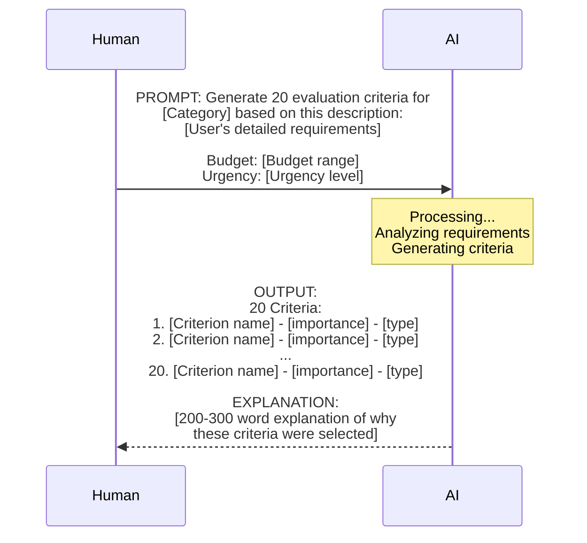
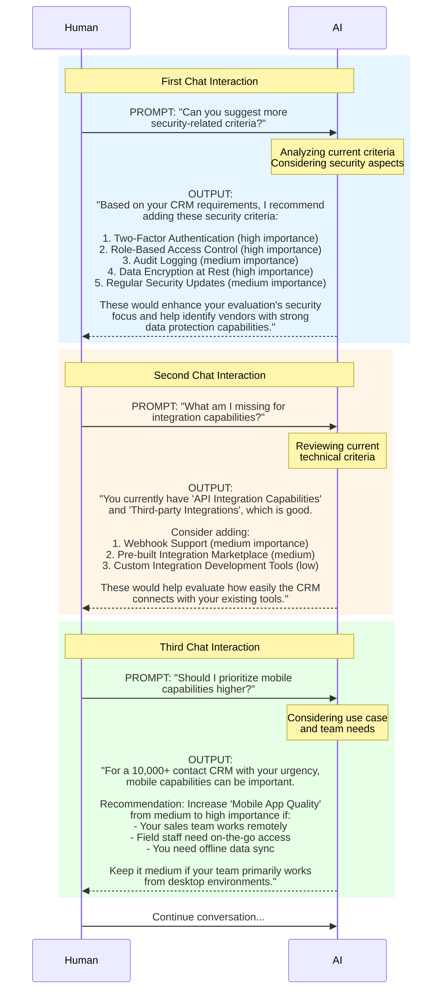
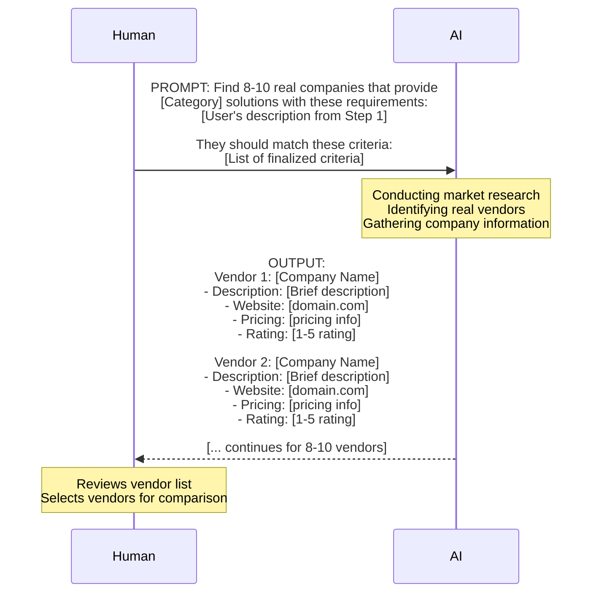
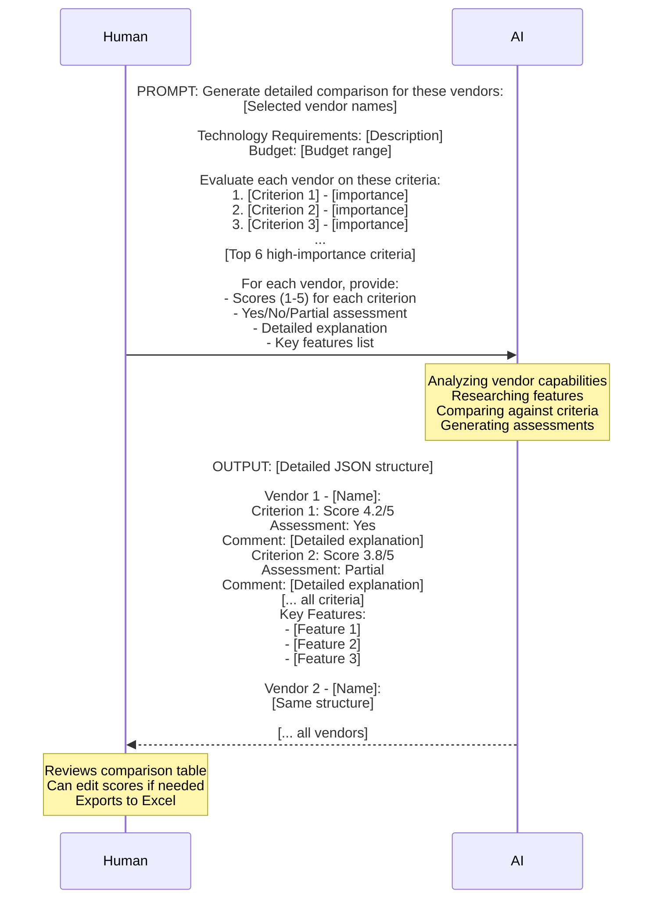
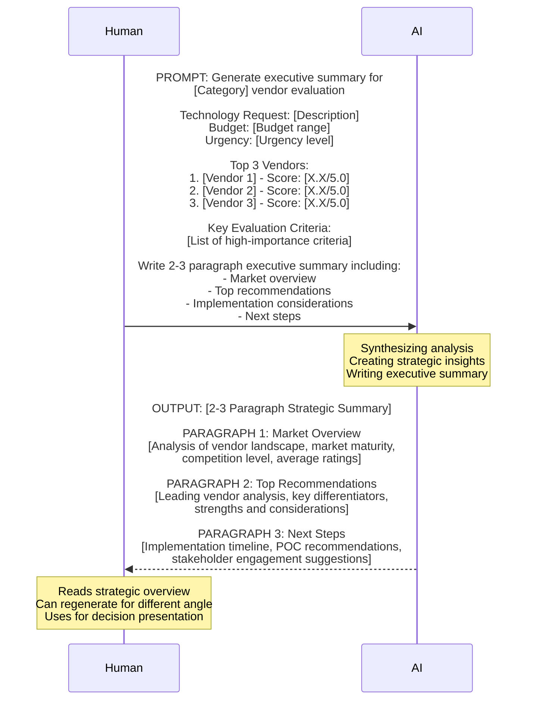
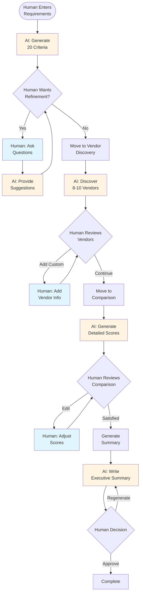

# Human-AI Interaction Workflow

**Vendora AI Vendor Analyst - Conversational AI Flow**

This document shows the direct conversation between the user and AI throughout the application workflow, focusing only on human prompts and AI outputs.

**Last Updated:** 2025-10-26

---

## Table of Contents

1. [Step 2: Criteria Generation & Refinement](#step-2-criteria-generation--refinement)
2. [Step 3: Vendor Discovery](#step-3-vendor-discovery)
3. [Step 4: Vendor Comparison Analysis](#step-4-vendor-comparison-analysis)
4. [Step 4: Executive Summary Generation](#step-4-executive-summary-generation)

---

## Step 2: Criteria Generation & Refinement

### Interaction 1: Initial Criteria Generation

**Context:** User has completed Step 1 and entered their technology requirements.



**Plain English Flow:**

1. **Human provides** (from Step 1):
   - Technology category (e.g., "CRM Software")
   - Detailed description (e.g., "Need a CRM that handles 10,000+ contacts with email automation and sales pipeline management")
   - Budget range (e.g., "$5,000 - $10,000/month")
   - Urgency (e.g., "High")

2. **AI receives request** and generates:
   - 20 evaluation criteria tailored to the requirements
   - Each criterion has:
     - Name (e.g., "Email Automation Workflows")
     - Importance (high/medium/low)
     - Type (feature/technical/business/compliance)
   - Detailed explanation of the selection rationale

3. **Human receives:**
   - Table populated with 20 criteria
   - Explanation appears in chat sidebar

**Example Output:**

```
CRITERIA:
1. Contact Management Capacity - high - feature
2. Email Automation Workflows - high - feature
3. Sales Pipeline Visualization - high - feature
4. API Integration Capabilities - high - technical
5. Mobile App Quality - medium - feature
6. Reporting & Analytics - high - feature
7. Customization Options - medium - feature
8. Data Import/Export - medium - technical
9. Multi-user Collaboration - high - feature
10. Performance & Speed - high - technical
11. Data Security & Encryption - high - compliance
12. Pricing Model Transparency - high - business
13. Customer Support Quality - medium - business
14. Training Resources - medium - business
15. Scalability - medium - technical
16. Third-party Integrations - high - technical
17. Workflow Automation - high - feature
18. GDPR Compliance - high - compliance
19. Backup & Recovery - medium - technical
20. Vendor Reputation - medium - business

EXPLANATION:
These criteria were specifically selected for CRM software evaluation based on your requirement to manage 10,000+ contacts with email automation. The emphasis on contact management capacity and email workflow automation (both rated high importance) directly addresses your core needs. Sales pipeline visualization is crucial for effective CRM usage at scale...

[Continues for 200-300 words explaining the rationale]
```

---

### Interaction 2: Chat-Based Refinement

**Context:** User wants to refine the generated criteria through conversation.



**Plain English Flow:**

1. **Human asks question** or makes request about criteria
2. **AI analyzes:**
   - Current criteria list
   - Tech requirements from Step 1
   - Context of the conversation
3. **AI responds** with:
   - Specific suggestions
   - Reasoning for recommendations
   - Importance levels
   - Actionable next steps
4. **Human can:**
   - Ask follow-up questions
   - Request different focus areas
   - Get explanations for suggestions
5. Conversation continues until human is satisfied

---

## Step 3: Vendor Discovery

### Interaction: AI Market Research

**Context:** User has finalized evaluation criteria and wants to find vendors.



**Plain English Flow:**

1. **Human provides** (automatically from previous steps):
   - Technology category
   - Detailed requirements
   - Budget range
   - Finalized criteria list

2. **AI performs market research:**
   - Identifies 8-10 real companies
   - Verifies they provide the requested solutions
   - Gathers basic information about each

3. **AI returns:**
   - Company name (real, established vendors)
   - Brief description (max 100 characters)
   - Website domain
   - Pricing information (if publicly available)
   - Market rating (1-5 scale based on reputation)

4. **Human receives:**
   - Vendor cards displayed in grid
   - All vendors auto-selected for comparison
   - Can add custom vendors or remove any

**Example Output:**

```
DISCOVERED VENDORS:

1. Salesforce
   Description: World's #1 CRM platform with comprehensive features
   Website: salesforce.com
   Pricing: $25-300/user/month
   Rating: 4.4

2. HubSpot
   Description: Inbound marketing & CRM platform with free tier
   Website: hubspot.com
   Pricing: Free-$3,200/month
   Rating: 4.5

3. Pipedrive
   Description: Simple and effective sales CRM for small teams
   Website: pipedrive.com
   Pricing: $14.90-99/user/month
   Rating: 4.2

4. Zoho CRM
   Description: Comprehensive business suite with CRM core
   Website: zoho.com
   Pricing: $14-52/user/month
   Rating: 4.0

5. Freshworks CRM
   Description: AI-powered customer platform with automation
   Website: freshworks.com
   Pricing: $29-125/user/month
   Rating: 4.3

6. Microsoft Dynamics 365
   Description: Enterprise CRM solution with Office integration
   Website: microsoft.com
   Pricing: $65-200/user/month
   Rating: 4.1

7. Monday.com CRM
   Description: Visual CRM workflows with project management
   Website: monday.com
   Pricing: $8-24/user/month
   Rating: 4.3

8. Insightly
   Description: CRM with project management for growing businesses
   Website: insightly.com
   Pricing: $29-99/user/month
   Rating: 4.0
```

---

## Step 4: Vendor Comparison Analysis

### Interaction: Detailed Vendor Evaluation

**Context:** User has selected vendors and wants AI to compare them against criteria.



**Plain English Flow:**

1. **Human provides** (from previous steps):
   - List of selected vendors
   - Technology requirements
   - Budget constraints
   - Full list of evaluation criteria (system sends top 6 for efficiency)

2. **AI conducts deep analysis:**
   - For each vendor:
     - Evaluates against each criterion
     - Assigns numerical score (1-5)
     - Determines Yes/No/Partial fit
     - Writes detailed comment explaining the assessment
     - Identifies 5 key features

3. **AI returns structured data:**
   - Scores for every vendor-criterion combination
   - Assessments with explanations
   - Feature highlights
   - All in parseable JSON format

4. **Human receives:**
   - Interactive comparison table
   - Scores displayed with progress bars
   - Color-coded badges (Yes=green, Partial=yellow, No=red)
   - Comments visible on hover or in cells
   - Overall weighted scores calculated automatically

**Example Output:**

```json
[
  {
    "name": "Salesforce",
    "criteriaScores": {
      "Contact Management Capacity": 5.0,
      "Email Automation Workflows": 4.5,
      "Sales Pipeline Visualization": 4.8,
      "API Integration Capabilities": 4.7,
      "Mobile App Quality": 4.3,
      "Reporting & Analytics": 4.6
    },
    "criteriaAnswers": {
      "Contact Management Capacity": {
        "yesNo": "yes",
        "comment": "Salesforce excels at managing 10,000+ contacts with unlimited scaling. Their contact management includes custom fields, relationship mapping, and advanced segmentation that easily handles your requirements."
      },
      "Email Automation Workflows": {
        "yesNo": "yes",
        "comment": "Marketing Cloud provides sophisticated email automation with journey builder, trigger-based campaigns, and A/B testing. Fully supports your automation needs with drag-and-drop workflow design."
      },
      "Sales Pipeline Visualization": {
        "yesNo": "yes",
        "comment": "Industry-leading pipeline visualization with customizable stages, drag-and-drop deal movement, and real-time forecasting. Includes AI-powered insights for deal progression."
      }
    },
    "features": [
      "Einstein AI for predictive analytics",
      "AppExchange marketplace with 3,000+ integrations",
      "Mobile app with offline capabilities",
      "Custom workflow automation builder",
      "Real-time collaboration tools"
    ]
  },
  {
    "name": "HubSpot",
    "criteriaScores": {
      "Contact Management Capacity": 4.2,
      "Email Automation Workflows": 4.6,
      "Sales Pipeline Visualization": 4.3,
      "API Integration Capabilities": 4.0,
      "Mobile App Quality": 4.1,
      "Reporting & Analytics": 4.4
    },
    "criteriaAnswers": {
      "Contact Management Capacity": {
        "yesNo": "yes",
        "comment": "HubSpot handles 10,000+ contacts well with their Professional tier. Contact database includes lifecycle stages, custom properties, and list segmentation suitable for your scale."
      },
      "Email Automation Workflows": {
        "yesNo": "yes",
        "comment": "Excellent email automation through Marketing Hub with visual workflow builder, personalization tokens, and behavioral triggers. Strong integration between marketing and sales automation."
      },
      "Sales Pipeline Visualization": {
        "yesNo": "partial",
        "comment": "Good pipeline visualization with deal stages and forecasting, but less customizable than enterprise options. Provides solid basics but may require higher tiers for advanced features."
      }
    },
    "features": [
      "Free CRM tier with upgrade path",
      "Integrated marketing and sales platform",
      "Conversation intelligence (call recording)",
      "Document tracking and templates",
      "Native meeting scheduler"
    ]
  }
]
```

---

## Step 4: Executive Summary Generation

### Interaction: Strategic Analysis

**Context:** User wants a high-level strategic summary of the vendor comparison.



**Plain English Flow:**

1. **Human provides** (automatically from analysis):
   - Technology category and requirements
   - Budget and urgency constraints
   - Top 3 ranked vendors with scores
   - High-importance criteria that drove evaluation

2. **AI creates strategic synthesis:**
   - Analyzes overall market landscape
   - Identifies key differentiators between top vendors
   - Considers budget and timeline constraints
   - Provides actionable recommendations

3. **AI writes executive summary:**
   - Paragraph 1: Market context and vendor landscape
   - Paragraph 2: Detailed top recommendations
   - Paragraph 3: Implementation path and next steps
   - Written for C-level stakeholders
   - Avoids technical jargon
   - Focuses on business value

4. **Human receives:**
   - 2-3 paragraph professional summary
   - Market insight badges (Mature, Competitive, etc.)
   - Key metrics visualization
   - Can regenerate for fresh perspective

**Example Output:**

```
EXECUTIVE SUMMARY

Our analysis of the CRM Software market has identified 8 qualified vendors to meet your immediate technology requirements for managing 10,000+ contacts with email automation. The evaluation considered 20 key criteria across feature capabilities, technical requirements, business alignment, and compliance needs. The CRM market demonstrates strong maturity with an average vendor rating of 4.3 stars and highly competitive offerings, indicating multiple viable options for your organization.

Salesforce emerges as the leading candidate with an overall score of 4.6/5.0, offering industry-leading contact management capacity and sophisticated email automation workflows that directly address your core requirements. The platform's Einstein AI capabilities and extensive AppExchange marketplace (3,000+ integrations) provide exceptional scalability for future growth. HubSpot follows closely at 4.4/5.0, presenting a compelling alternative with excellent email automation and a more accessible pricing model ($29-125/user/month vs. Salesforce's $65-200/user/month). For budget-conscious implementations, Pipedrive (4.2/5.0) delivers solid core CRM functionality at $14.90-99/user/month with particular strength in sales pipeline visualization.

Given your $5,000-$10,000/month budget and high urgency timeline, we recommend initiating detailed discussions with Salesforce and HubSpot as primary candidates, with Pipedrive as a cost-effective alternative. Key next steps include: (1) Conducting proof-of-concept evaluations with each vendor focusing on email automation workflows and contact import processes, (2) Obtaining detailed pricing proposals based on your 10,000+ contact scale and required user count, and (3) Scheduling stakeholder demos to validate functional requirements and ensure optimal vendor-organization fit. Implementation timeline for either top candidate is estimated at 6-8 weeks including data migration and user training.
```

---

## Summary: Complete Human-AI Conversation Flow



---

## Interaction Patterns

### Pattern 1: Generate → Review → Refine

**Used in:** Criteria Generation, Vendor Discovery

1. AI generates initial output automatically
2. Human reviews the results
3. Human can request refinements through chat
4. AI provides updated suggestions
5. Loop continues until human is satisfied

### Pattern 2: Generate → Display → Edit

**Used in:** Vendor Comparison

1. AI generates comprehensive analysis
2. Results displayed in interactive table
3. Human can manually edit any score
4. System recalculates dependent values
5. No back-and-forth chat needed

### Pattern 3: Generate → Review → Regenerate

**Used in:** Executive Summary

1. AI generates strategic summary
2. Human reads the analysis
3. Human can click "Regenerate" for new perspective
4. AI creates fresh summary with different angle
5. Process repeats until human is satisfied

---

## AI Response Times

| Interaction | Expected Duration | User Feedback |
|-------------|------------------|---------------|
| Generate 20 Criteria | 3-5 seconds | Loading spinner with progress |
| Chat Response | 2-4 seconds | Typing indicator (animated dots) |
| Discover Vendors | 4-6 seconds | "Discovering vendors..." message |
| Detailed Comparison | 5-8 seconds | Progress bar at 75% |
| Executive Summary | 3-5 seconds | "Generating summary..." with pulse |

---

## Total AI Interactions Per Workflow

**Minimum (if no refinement):**
- 1 × Criteria Generation
- 1 × Vendor Discovery
- 1 × Detailed Comparison
- 1 × Executive Summary
= **4 AI interactions**

**Typical (with some refinement):**
- 1 × Criteria Generation
- 2-3 × Chat refinements
- 1 × Vendor Discovery
- 1 × Detailed Comparison
- 1 × Executive Summary
= **6-8 AI interactions**

**Maximum (heavy refinement):**
- 1 × Criteria Generation
- 5-10 × Chat refinements
- 2-3 × Vendor rediscovery (different models)
- 2-3 × Detailed comparison regeneration
- 2-3 × Executive summary regeneration
= **12-20 AI interactions**

---

*This document focuses exclusively on the conversational flow between humans and AI, showing the natural progression of prompts and outputs throughout the vendor evaluation process.*

**Version:** 1.0
**Last Updated:** 2025-10-26
